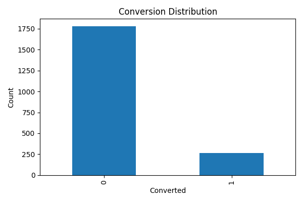
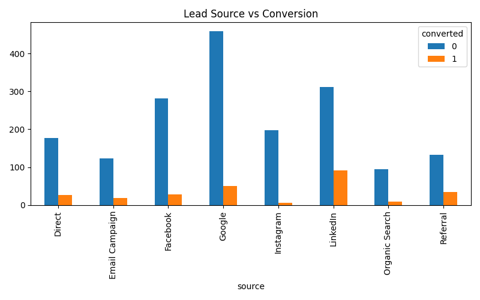
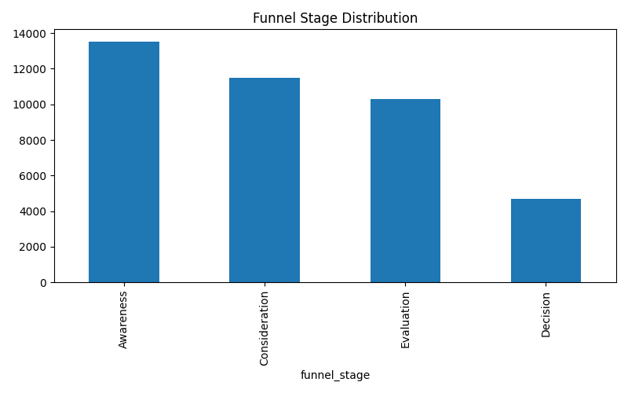
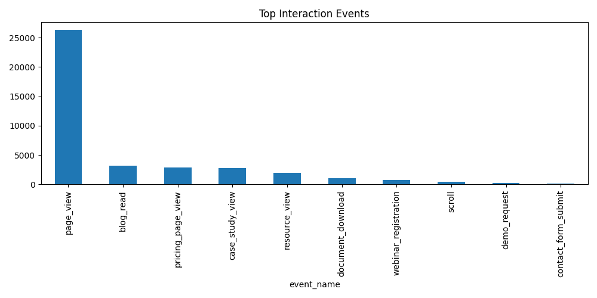
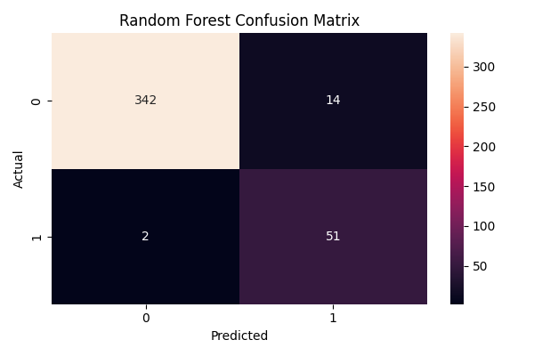
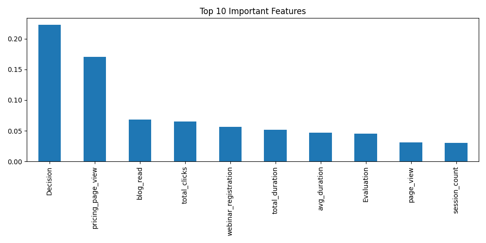
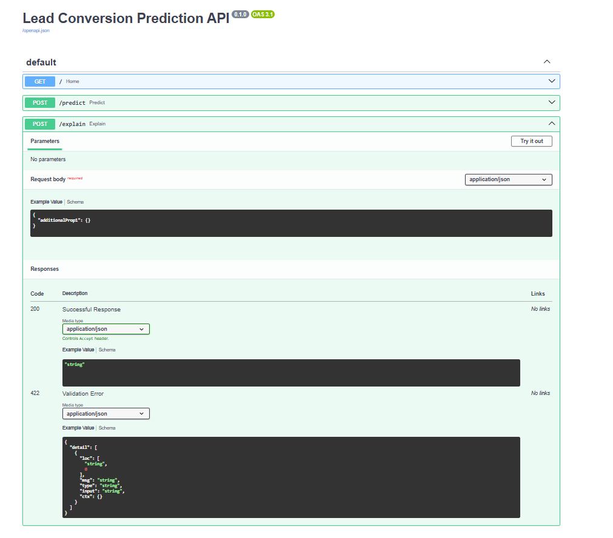
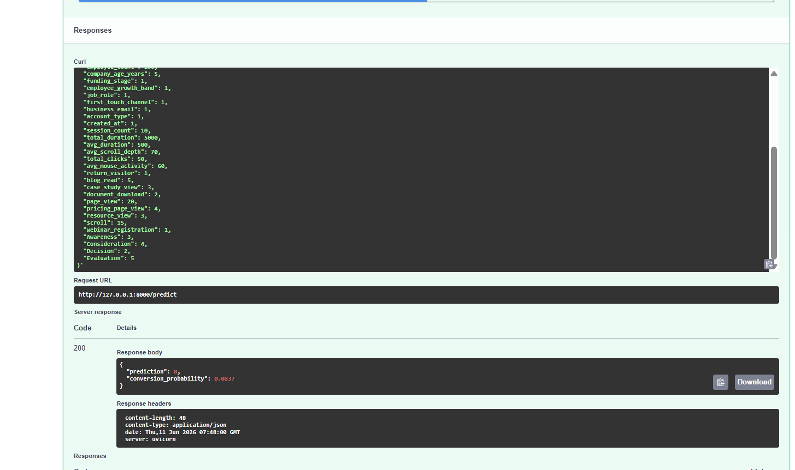
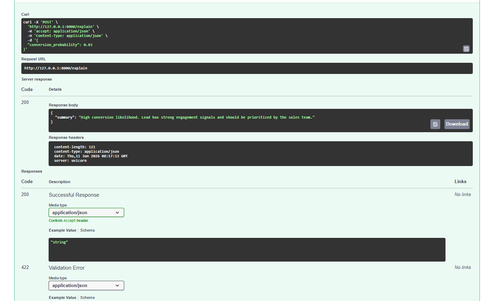

# 🚀 Lead Conversion Prediction System

## 📖 Project Overview

This project predicts whether a lead is likely to convert into a customer using Machine Learning.

The solution combines:

✅ Lead Demographic Information
✅ Company Information
✅ Website Behavioral Data
✅ Customer Journey Funnel Data

to help sales and marketing teams identify high-potential leads and prioritize outreach efforts.

---

## 🎯 Business Problem

Sales teams often receive thousands of leads but have limited resources to contact everyone effectively.

This project helps organizations:

* 🎯 Prioritize high-conversion leads
* 📈 Improve sales efficiency
* 💰 Increase marketing ROI
* ⏳ Reduce time spent on low-quality leads
* 🚀 Improve lead nurturing strategies

---

## 📊 Dataset Description

### Leads Dataset

Contains lead and company-related information such as:

* Source
* Campaign
* City
* State
* Region
* Industry
* Company Size
* Employee Count
* Funding Stage
* Job Role
* Device Type
* Browser
* First Touch Channel

### Interactions Dataset

Contains website behavioral activities such as:

* Page Views
* Scroll Events
* Blog Reads
* Webinar Registrations
* Resource Views
* Pricing Page Visits
* Document Downloads
* Session Duration
* Mouse Activity

---

## 🎯 Target Variable Creation

A lead is marked as converted if any of the following conversion events occur:

* Demo Request
* Contact Form Submission
* Free Trial Start

Target Variable:

```text
Converted = 1
Not Converted = 0
```

---

## ⚙️ Feature Engineering

Behavioral features were generated from interaction logs.

### 📌 Session Features

* Session Count
* Total Duration
* Average Duration
* Average Scroll Depth
* Total Clicks
* Average Mouse Activity
* Return Visitor Flag

### 📌 Event Features

* Blog Read Count
* Case Study View Count
* Document Download Count
* Pricing Page View Count
* Resource View Count
* Webinar Registration Count

### 📌 Funnel Stage Features

* Awareness
* Consideration
* Evaluation
* Decision

---

## 📈 Final Dataset Summary

| Stage                           | Count |
| ------------------------------- | ----- |
| Original Lead Features          | 21    |
| Target Variable                 | 1     |
| Engineered Interaction Features | 22    |
| Final Dataset Columns           | 44    |
| Training Features               | 39    |
| Target Variable                 | 1     |

---

## 🔍 Exploratory Data Analysis (EDA)

The following visualizations were created:

### 📊 Conversion Distribution



### 📊 Source-wise Conversion Analysis



### 📊 Funnel Stage Distribution



### 📊 Event Distribution



### 📊 Confusion Matrix



### 📊 Feature Importance



---

## 🤖 Machine Learning Models

Three classification models were trained and evaluated.

### 1️⃣ Logistic Regression

#### Improvements Applied

✅ StandardScaler
✅ Class Weight Balancing
✅ Increased Iterations

#### Results

| Metric    | Value  |
| --------- | ------ |
| Accuracy  | 0.9487 |
| Precision | 0.7500 |
| Recall    | 0.9057 |
| F1 Score  | 0.8205 |
| AUC ROC   | 0.9846 |

---

### 2️⃣ Random Forest (Best Model)

#### Improvements Applied

✅ 300 Decision Trees
✅ Balanced Class Weights
✅ Depth Optimization

#### Results

| Metric    | Value  |
| --------- | ------ |
| Accuracy  | 0.9609 |
| Precision | 0.7846 |
| Recall    | 0.9623 |
| F1 Score  | 0.8644 |
| AUC ROC   | 0.9904 |

---

### 3️⃣ XGBoost

#### Improvements Applied

✅ Class Imbalance Handling
✅ Learning Rate Optimization
✅ Tree Depth Optimization

#### Results

| Metric    | Value  |
| --------- | ------ |
| Accuracy  | 0.9438 |
| Precision | 0.7586 |
| Recall    | 0.8302 |
| F1 Score  | 0.7928 |
| AUC ROC   | 0.9858 |

---

## 🏆 Model Comparison

| Model               | Accuracy | Precision | Recall   | F1 Score | AUC ROC  |
| ------------------- | -------- | --------- | -------- | -------- | -------- |
| Logistic Regression | 0.9487   | 0.7500    | 0.9057   | 0.8205   | 0.9846   |
| Random Forest       | 0.9609   | 0.7846   | 0.9623    | 0.8644   | 0.9904 |
| XGBoost             | 0.9438   | 0.7586    | 0.8302   | 0.7928   | 0.9858   |

---

## 🎯 Best Model Selection

### ✅ Random Forest Selected

Reasons:

* Highest Accuracy
* Highest Recall
* Highest F1 Score
* Highest AUC ROC

### Business Impact

A Recall of **96.23%** ensures that most potential converting leads are successfully identified, reducing missed sales opportunities.

---

## 🔬 Feature Importance Insights

The model identified the following highly influential features:

* Session Count
* Total Duration
* Pricing Page Views
* Scroll Activity
* Resource Views
* Funnel Stage Metrics

### Key Insight

Users who spend more time interacting with pricing pages and resources have significantly higher conversion probabilities.

---

## 🚀 FastAPI Deployment

The selected Random Forest model was deployed using FastAPI.

### Available Endpoints

### 🏠 Home Endpoint

```http
GET /
```

Returns API status.




---

### 🎯 Prediction Endpoint

```http
POST /predict
```

Example Response:

```json
{
  "prediction": 0,
  "conversion_probability": 0.83
}
```

---

### 💡 Explain Endpoint

```http
POST /explain
```

Provides business-friendly interpretation of prediction probability.

Example Response:

```json
{
  "summary": "High conversion likelihood. Lead has strong engagement signals and should be prioritized by the sales team."
}
```

---

## ⚡ Running the Project

### Install Dependencies

```bash
pip install -r requirements.txt
```

### Train the Model

```bash
python train.py
```

### Start FastAPI Server

```bash
uvicorn app:app --reload
```

### Open Swagger Documentation

```text
http://127.0.0.1:8000/docs
```

---

## 🛠️ Technologies Used

* Python
* Pandas
* NumPy
* Scikit-Learn
* XGBoost
* Matplotlib
* FastAPI
* Joblib

---

## 📂 Project Structure

```text
Lead-Conversion-Predictor/
│
├── data/
│
├── outputs/
│   ├── confusion_matrix.png
│   ├── conversion_distribution.png
│   ├── source_conversion.png
│   ├── funnel_stage_distribution.png
│   ├── event_distribution.png
│   ├── feature_importance.png
│   ├── swagger_docs.png
│   ├── predict_api.png
│   ├── explain_api.png
│   └── model_metrics.json
│
├── target_creation.py
├── feature_engineering.py
├── eda.py
├── train.py
├── app.py
│
├── model.pkl
├── requirements.txt
├── README.md
├── analysis.md
└── .gitignore
```
---

## 🎉 Project Outcome

Successfully developed an end-to-end Lead Conversion Prediction System capable of identifying high-value leads using demographic and behavioral data.

### Final Production Model Performance

🏆 Random Forest

* Accuracy: 0.9609
* Precision: 0.7846
* Recall: 0.9623
* F1 Score: 0.8644
* AUC ROC: 0.9904

### Business Value

✅ Better Lead Prioritization
✅ Improved Sales Productivity
✅ Increased Marketing Efficiency
✅ Data-Driven Decision Making

---

## 👨‍💻 Author

**Sakshi Bamane**

Machine Learning | Data Science | Data Analytics

Built as an end-to-end Machine Learning project for Lead Conversion Prediction and Sales Intelligence.
